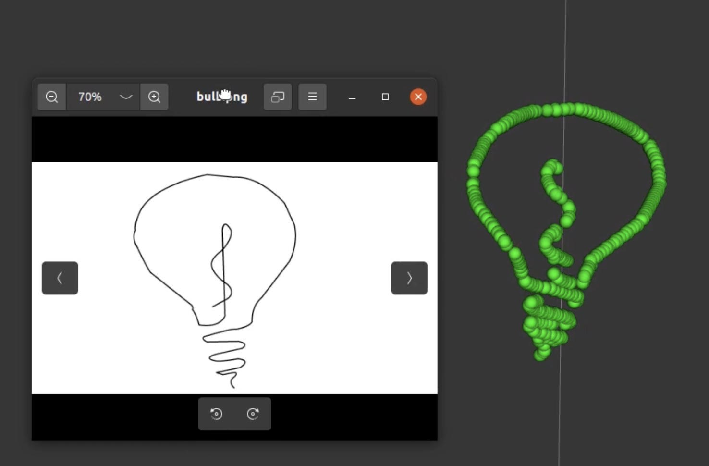
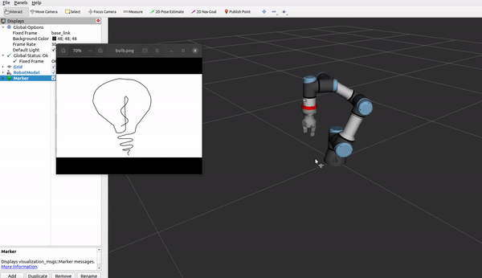

# Drawing Robot Arm : Extension for UR3 package

This package was made to operate a drawing robot within the ROS environment, utilizing https://github.com/cambel/ur3. It is straightforward: upon inputting an image, it allows for the simulation of a robotic arm drawing the given image in the Rviz interface.




## Installation

First, you need to prepare your computer to use cambel UR3 package simulation environment. 
After all setting is done, clone this package to your workspace and compile with catkin. 

```
$ cd src
$ git clone https://github.com/zzziito/Drawing_Robot_Arm.git
$ cd .. && catkin build
$ soure devel/setup.bash
```


## Simulation with Rviz

Place your desired picture inside "image" folder and run these commands : 


```
$ roslaunch ur3_gazebo ur_gripper_hande_cubes.launch ur_robot:=ur3e grasp_plugin:=1
$ roslaunch ur_hande_moveit_config start_moveit.launch
$ rosrun ur3_moveit_pkg draw.py
```